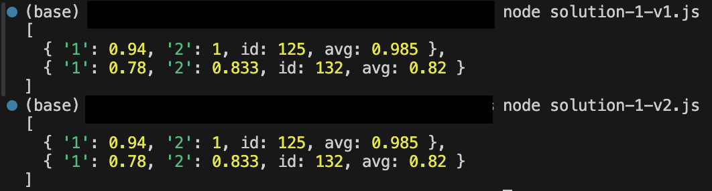

# JavaScript-SBA-308

Check my code in:
- solution-1-v1.js: the first version of the solution 1.
- solution-1-v2.js: the simplified version of the solution 1.
- solution-2.js: another solution.

## solution-1-v1.js
For this solution, there's no need to find the existing data for the learners, add the score to the existing data, nor remove the extra data.
1. Create a list of ```learners``` with a list of submission information. ```learners``` will be:
```
{
  '125': [
    [ 1, '2023-01-25', 47 ],
    [ 2, '2023-02-12', 150 ],
    [ 3, '2023-01-25', 400 ]
  ],
  '132': [ [ 1, '2023-01-24', 39 ], [ 2, '2023-03-07', 140 ] ]
}
```
2. Create a list of learners' id. ```learners_id``` will be:
```
[ '125', '132' ]
```
3. For each learner, create the result list of objects in the format as requested: {id:'123', avg:0.98, 1:0.98, 2:1.0}, which will be stored in ```learner_info```.
- Checked if an assignment is not yet due, do not include it in the results.
- Checked if the learner's submission is late, deduct 10% of the total points_possible from their score of that assignment.   
For learner id 125, the ```learner_info``` will be:
```
{ '1': 0.94, '2': 1, id: 125, avg: 0.985 }
```
Note: The assignment_id (e.g. ```'1'```) is represented as a string in the output. This is just a representation issue in the console, and the keys are indeed stored as numbers in the object.  
For learner id 132, the ```learner_info``` will be:
```
{ '1': 0.78, '2': 0.833, id: 132, avg: 0.82 }
```
4. Append each learner's information to the results list as the final output. ```results``` will be:
```
[
  { '1': 0.94, '2': 1, id: 125, avg: 0.985 },
  { '1': 0.78, '2': 0.833, id: 132, avg: 0.82 }
]
```
5. check the validation of the input data.
- If an AssignmentGroup does not belong to its course, throw an error.
- If points_possible is 0, throw an error.
- If a value is a string instead of a number, throw an error.
Also put the ```try/catch``` inside and at the beginning of the ```function getLearnerData```, it worked.  
But in order for the readability, ```try/catch``` was decided to put outside the function.

## solution-1-v2.js
This is the simplified version of solution 1.  
Most of the steps were the same as solution-1-v1.js.
Except that the version 2 does not create a list of learners' id.
It returns the same ```results``` as the ```solution-1-v1.js```.

Tested ```try/catch```:
